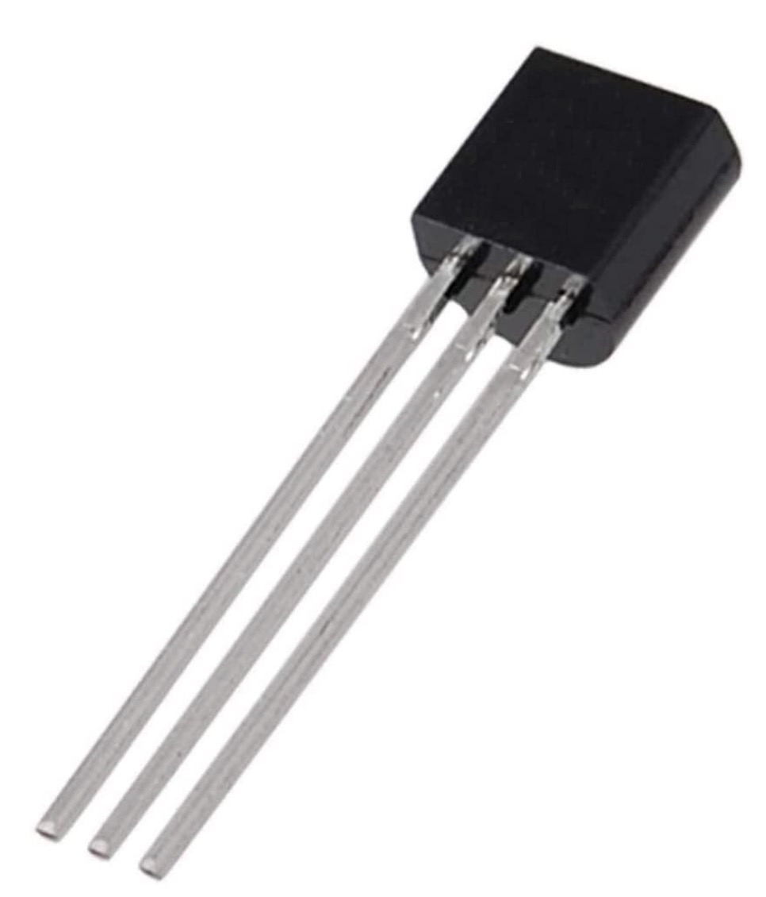

# 1.你管这破玩意叫CPU？

#### 伟大的发明

过去200年人类最重要的发明是什么？蒸汽机？电灯？火箭？这些可能都不是，最重要的也许是这个 小东西：

这个小东西就叫晶体管，你可能会问，晶体管有什么用呢？

实际上晶体管的功能简单到不能再简单，给一端通上电，那么电流可以从另外两端通过，否则不能通 过，其本质就是一个开关。

就是这个小东西的发明让三个人获得了诺贝尔物理学奖，可见其举足轻重的地位。

**无论程序员编写的程序多么复杂，软件承载的功能最终都是通过这个小东西简单的开闭完成的**，除了 神奇二字，我想不出其它词来。

#### AND、 OR、 NOT

现在有了晶体管，也就是开关，在此基础之上就可以搭积木了，你随手搭建出来这样三种组合：

* 两个开关只有同时打开电流才会通过，灯才会亮
* 两个开关中只要有一个打开电流就能通过，灯就会亮
* 当开关关闭时电流通过灯会亮，打开开关灯反而电流不能通过灯会灭

天赋异禀的你搭建的上述组合分别就是：与门，AND Gate、或门，OR gate、非门，NOT gate，用 符号表示就是这样：

#### 道生一、一生二、二生三、三生万物

最神奇的是，你随手搭建的三种电路竟然有一种很amazing的特性，那就是：任何一个逻辑函数最终 都可以通过AND、OR以及NOT表达出来，这就是所谓的逻辑完备性，就是这么神奇。

也就是说**给定足够的AND、OR以及NOT门，就可以实现任何一个逻辑函数，除此之外我们不需要任 何其它类型的逻辑门电路**，这时我们认为{AND、OR、NOT}就是逻辑完备的。

这一结论的得出吹响了计算机革命的号角，这个结论告诉我们计算机最终可以通过简单的{AND、 OR、NOT}门构造出来，就好比基因。

老子有云：道生一、一生二、二生三、三生万物，实乃异曲同工之妙。

虽然，我们可以用{AND、OR、NOT}来实现所有的逻辑运算，但我们真的需要把所有的逻辑运算都用 {AND、OR、NOT}们实现出来吗？显然不是，而且这也不太可行。

#### 计算能力是怎么来的

现在能生成万物的基础元素与或非门出现了，接下来我们着手设计CPU 最重要的能力：计算，以加法 为例。

由于CPU只认知 0 和 1，也就是二进制，那么二进制的加法有哪些组合呢：

* 0 + 0，结果为0，进位为0
* 0 + 1，结果为1，进位为0
* 1 + 0，结果为1，进位为0
* 1 + 1，结果为0，进位为1，二进制嘛！

注意进位一列，只有当两路输入的值都是 1 时，进位才是 1 ，看一下你设计的三种组合电路，这就是 与门啊，有没有！

再看下结果一列，当两路输入的值不同时结果为1，输入结果相同时结果为0，这就是异或啊，有没 有！我们说过与或非门是逻辑完备可以生万物的，异或逻辑当然不在话下，用一个与门和一个异或门 就可以实现二进制加法：

上述电路就是一个简单的加法器，就问你神奇不神奇，加法可以实现，其它的也一样能用与或非门实 现，逻辑完备嘛。

根据需要可以将不同的算数运算设计出来，这就是所谓的arithmetic/logic unit，ALU，CPU 中专门 负责运算的模块，本质上和上面的简单电路没什么区别，就是更加复杂而已。

现在，通过与或非门的组合我们获得了计算能力。

但，只有计算能力是不够的，电路需要能**记得住**信息。

